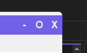
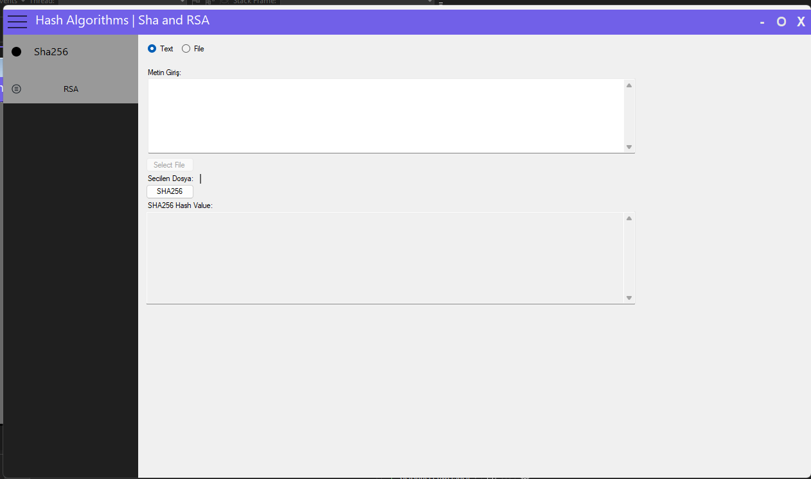
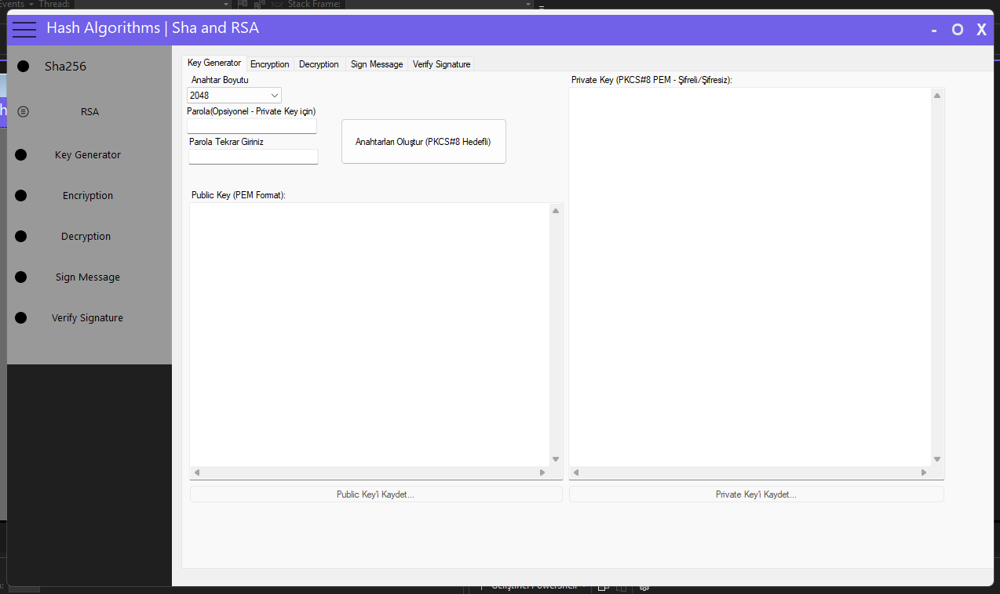
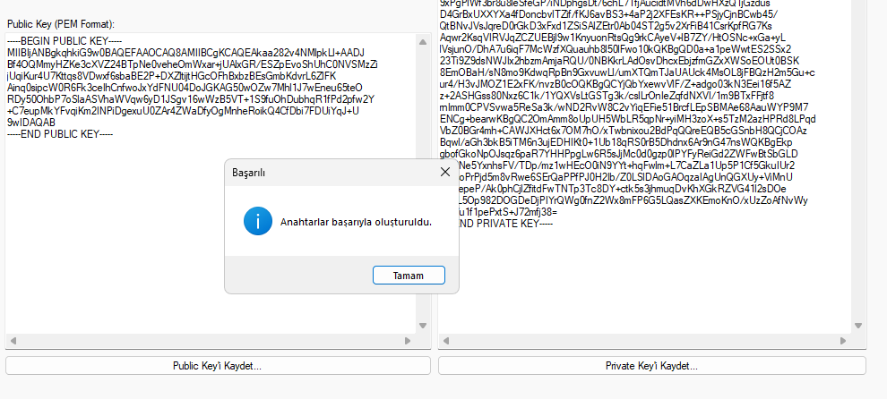
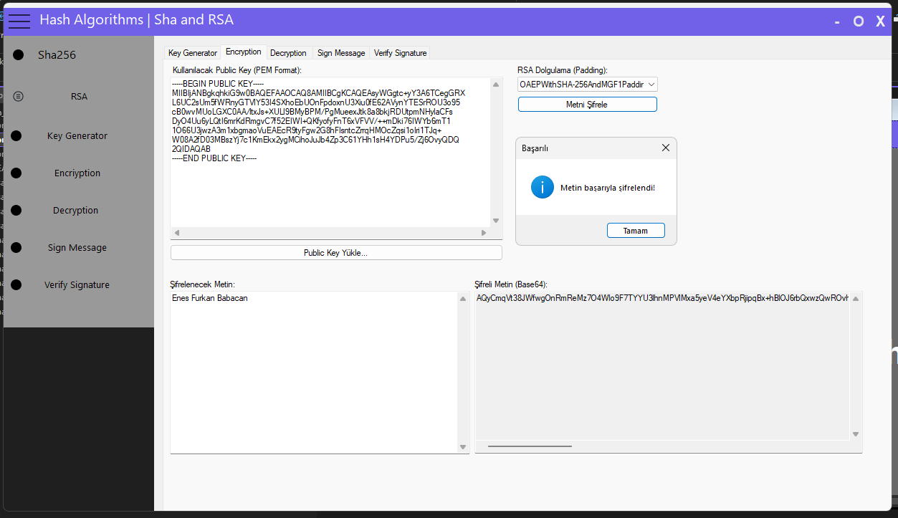
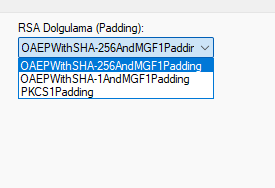
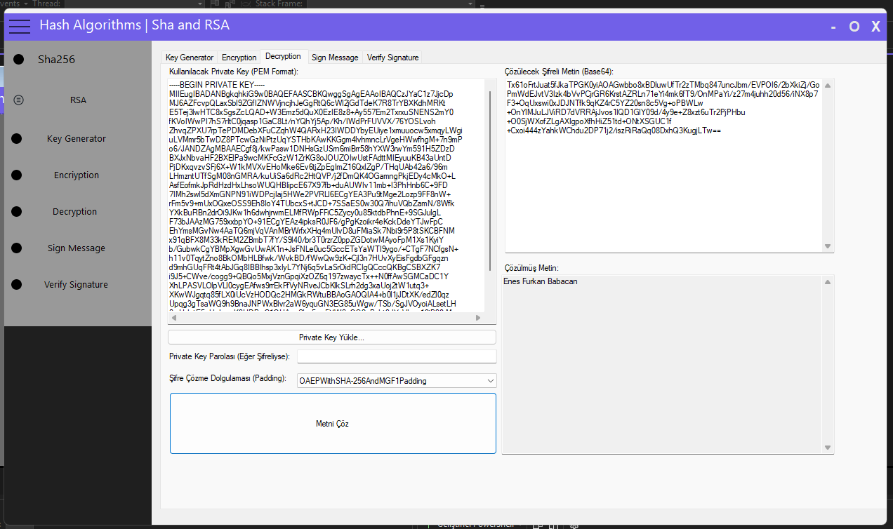
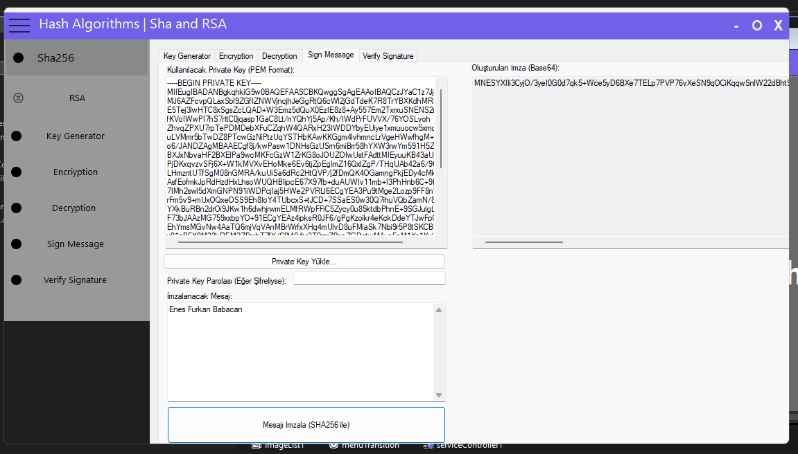
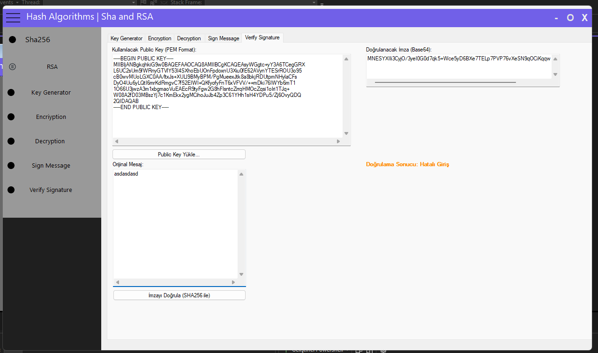

# RSA & SHA-256 Kriptografi Aracı

Bu proje, RSA asimetrik şifreleme ve SHA-256 hash algoritması işlemlerini gerçekleştirmek için C# ve .NET Framework 4.7.2 kullanılarak geliştirilmiş bir Windows Forms masaüstü uygulamasıdır. Kriptografik işlemler için popüler BouncyCastle kütüphanesinden yararlanılmıştır.

## ✨ Özellikler

### SHA-256 Hash
* Girilen metinlerin SHA-256 özetini (hash) hesaplama.
* Seçilen dosyaların SHA-256 özetini (hash) hesaplama.

### RSA Araç Takımı
Uygulama, RSA kriptografisi için kapsamlı bir araç takımı sunar:

* **Anahtar Üretimi:**
    * 1024, 2048, 3072 ve 4096 bit boyutlarında RSA anahtar çiftleri (Public/Private) oluşturma.
    * Oluşturulan özel anahtarı isteğe bağlı olarak bir parola ile şifreleyerek (PKCS#8 formatında) güvenliğini artırma.
    * Oluşturulan anahtarları PEM formatında kaydetme.

* **Şifreleme (Encryption):**
    * Bir Public Key kullanarak metinleri şifreleme.
    * Güvenli **OAEP** (SHA-1/SHA-256 ile) ve eski sistemlerle uyumluluk için **PKCS#1 v1.5** dolgulama (padding) şemalarını destekleme.
    * Şifrelenmiş veriyi taşınabilirliği kolaylaştırmak için Base64 formatında sunma.

* **Deşifreleme (Decryption):**
    * Bir Private Key kullanarak şifrelenmiş metinleri çözme.
    * Parola ile korunan Private Key'leri destekleme.
    * Şifreleme sırasında kullanılan dolgulama şemasına uygun olarak deşifreleme yapma.

* **Dijital İmza (Signature):**
    * Bir mesajı, sahibine ait Private Key ile imzalama (`SHA256withRSA`).
    * Oluşturulan imzayı Base64 formatında sunma.

* **İmza Doğrulama (Verification):**
    * Bir imzayı, orijinal mesajı ve Public Key'i kullanarak doğrulama.
    * Doğrulama sonucunu kullanıcıya net bir şekilde (Geçerli/Geçersiz) bildirme.

### Kullanıcı Arayüzü
* Tüm işlevleri sekmeler altında toplayan modern ve kullanışlı arayüz.
* Animasyonlu ve açılır/kapanır menü tasarımı.
* Sürüklenebilir, kenarlıksız pencere yapısı.

---

## 🛠️ Kullanılan Teknolojiler
* **C#**
* **.NET Framework 4.7.2**
* **Windows Forms**
* **BouncyCastle.Cryptography (v2.6.1)**

---

## 🚀 Kurulum (Installation)
Bu projeyi kendi bilgisayarınızda çalıştırmak için aşağıdaki adımları izleyin:

1.  Projeyi klonlayın veya ZIP olarak indirin.
    \`\`\`bash
    git clone https://github.com/EFBabacan/Sha_and_Rsa.git
    \`\`\`
2.  İndirdiğiniz klasördeki `Sha_and_RSA.sln` dosyasını Visual Studio ile açın.
3.  Solution Explorer'da Solution'a (en üstteki çözüm öğesi) sağ tıklayıp **"Restore NuGet Packages"** (NuGet Paketlerini Geri Yükle) seçeneğini seçin. Bu işlem, proje için gerekli olan BouncyCastle kütüphanesini otomatik olarak indirecektir.
4.  Projeyi derlemek için `Build > Build Solution` menüsünü kullanın veya `F6` tuşuna basın.
5.  Projeyi çalıştırmak için `Debug > Start Debugging` menüsünü kullanın veya `F5` tuşuna basın.

---

## 🖼️ Ekran Görüntüleri

      -Bu ekranda başlangıç sayfası gözükmete. sol tarafta menu kısmı , sağ üstte ise control kısmı yer almakta.
      

      -Bu görüntüde alta alma , tam ekran yapma ve kapatma butonu yer almakta.
      

      -Bu ekran isteğe bağlı olarak 2 farklı Sha256 özetleme  yöntemi vardır. Metin özetleme ve Dosya özetleme.

      -Bu ekrandan istenilen karakter sayısı ve isteğe bağlı olaral şifre belirleyerek private ve public key üretmekte. Public ve Private key'i istenilen yere yükleme seçeneğide mevcuttur.

      -Bu ekrandan anahtar oluşturulmuştur.

      -Bu ekrandan istnilene bağlı olara 3 farklı rsa dolgulama yöntemininden birini seçerek public key ile şifreli metin üretiyoruz. Public key'i istenilen yerden yükleme seçeneğide mevcuttur.

      -Bu ekranda private key'i yükledikden sonra şifreli ise şifresini girip , uygun olan rsa dolgulama yöntemi ile şifreli metni çözüyoruz.

      -Bu ekran private key ile mesaj imzalıyoruz.

      -Bu ekran public key ile imzayı doğruluyoruz.

